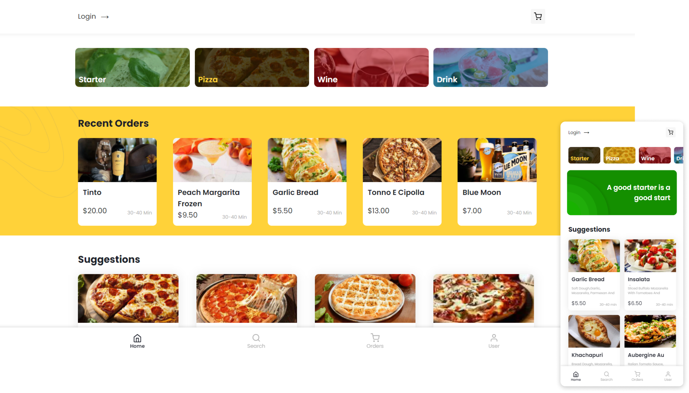

<div id="top"></div>

<div align="center">
   <a href="#">
       
  </a>
   <a href="#">
          
   </a>
   <a href="#">
       
   </a>
   <a href="#">
       
   </a>
   <a href="#">
      
   </a>
   <a href="#">
      
   </a>
   <a href="https://www.linkedin.com/in/marcos-antonio-579370160/" target="_blank">
      
    </a>
</div>

<!-- PROJECT LOGO -->
<br />
<div align="center">
  <a href="https://noemia.vercel.app/" target="_blank"> 
    
  </a>

  <h3 align="center">Place order and be happy!</h3>

  <p align="center"> 
    <a href="https://noemia.vercel.app/" target="_blank">Try Yourself</a>
    ·
    <a href="https://github.com/Marcos-An/noemia/issues" target="_blank">Report Bug</a>
    ·
    <a href="#contact">Get in Touch!</a>
  </p>
</div>

<!-- TABLE OF CONTENTS -->
<details>
  <summary>Table of Contents</summary>
  <ol>
    <li>
      <a href="#about-the-project">About The Project</a> 
    </li>
    <li><a href="#roadmap">Roadmap</a></li> 
    <li>
      <a href="#getting-started">Getting Started</a> 
    </li>  
    <li><a href="#built-with">Built With</a></li>
    <li><a href="#contact">Contact</a></li> 
    <li><a href="#license">Lisence</a></li> 
  </ol>
</details>

<!-- ABOUT THE PROJECT -->

## About The Project

<a href="https://noemia.vercel.app/" target="_blank">
  
</a> 

Noemia is a project to practice some skills building a Full Stack project with NextJS, Hasura, GraphQL, Apollo, Postgres, JavaScript. Here you can order a experience of eat a pizza gourmet with a good wine after a delicious starter. You can do login, put somethings delicious in your cart and place a order :tada:
<br>
<a href="https://noemia.vercel.app/" target="_blank">
  Try Yourself!
</a>


A project was designed by me on Figma to be a mobile experience, so I recommend to open in a mobile device  
<a href="https://www.figma.com/file/ufb1wgIyAIzvQFVaJtYWkH/Noemia?node-id=0%3A1" target="_blank">you can see the project in Figma here</a>
 

<p align="right">(<a href="#top">back to top</a>)</p>


<!-- ROADMAP -->

## Roadmap

- [x] CRUD Cart - Create, Update, Delete items in your cart
- [x] CRUD User - Create, Update, Delete user informations, like address and payment methods
- [x] Main pages to see the items by categories
- [x] Search any item in Noemia
- [ ] List of latest orders 
- [ ] Order again


<p align="right">(<a href="#top">back to top</a>)</p>


<!-- GETTING STARTED -->

## Getting Started

### Installation and Running Locally
 
1. Clone the repo
   ```bash
   
   git clone https://github.com/Marcos-An/noemia.git
   
   ```
2. Install yarn/npm packages
   ```bash
   
   yarn || npm install 
   
   ```
3. Rename `.env.sample` to .env and fill the values:
   ```bash
      ## Firebase
    NEXT_PUBLIC_FIREBASE_API_KEY=
    NEXT_PUBLIC_FIREBASE_AUTH_DOMAIN=
    NEXT_PUBLIC_FIREBASE_PROJECT_ID=
    NEXT_PUBLIC_FIREBASE_STORAGE_BUCKET=
    NEXT_PUBLIC_FIREBASE_MESSAGING_SANDER_ID=
    NEXT_PUBLIC_FIREBASE_APP_ID=

    ## Hasura Connection
    NEXT_PUBLIC_DEFAULT_URI_APOLLO=
   ```

<p align="right">(<a href="#top">back to top</a>)</p>
 
 
## Built with

-   [React](https://pt-br.reactjs.org/)
-   [Next.js](https://nextjs.org/)
-   [Vercel](https://vercel.com) 
-   [Apollo GraphQL](https://www.apollographql.com/docs/react/)
-   [Hasura](https://hasura.io/)  
-   [Firebase](https://firebase.google.com/docs/)

<!-- CONTACT -->

## Contact
<a href="https://www.linkedin.com/in/marcos-antonio-579370160/" target="_blank">
  
  <p>Marcos Silva</p>
</a>
<br /> 
<div >
     <a href="https://www.linkedin.com/in/marcos-antonio-579370160/" target="_blank">
      
    </a>
   <a href="mailto:marcos.silva.0556@gmail.com" target="_blank">
      
    </a>

</div> 

<!-- CONTACT -->

## License

Distributed under the MIT License. See <a href="https://github.com/Marcos-An/noemia/blob/main/LICENSE" target="_blank"> MIT </a> for more information.

<p align="right">(<a href="#top">back to top</a>)</p>


